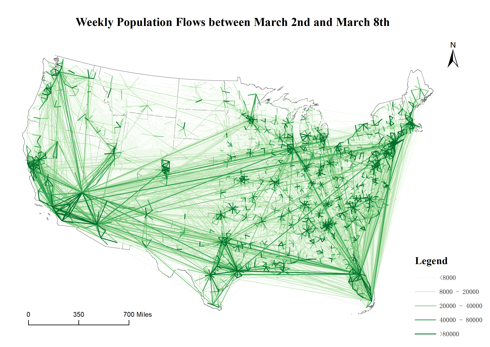
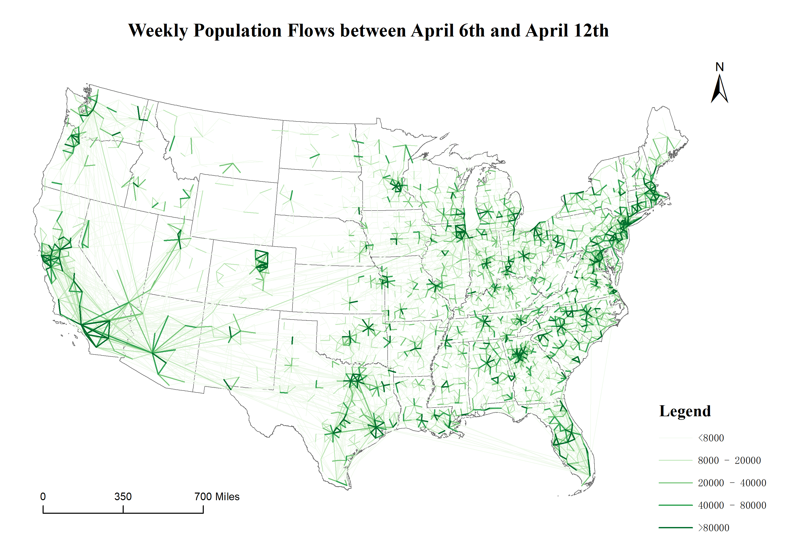

<!-- PROJECT SHIELDS -->
<!--
*** I'm using markdown "reference style" links for readability.
*** Reference links are enclosed in brackets [ ] instead of parentheses ( ).
*** See the bottom of this document for the declaration of the reference variables
*** for contributors-url, forks-url, etc. This is an optional, concise syntax you may use.
*** https://www.markdownguide.org/basic-syntax/#reference-style-links
-->
<!--[![Contributors][contributors-shield]][contributors-url]
[![Forks][forks-shield]][forks-url]
[![Stargazers][stars-shield]][stars-url]-->
[![MIT License][license-shield]][license-url]


<!-- PROJECT LOGO -->
<br />
<p align="center">
  <a href="https://geods.geography.wisc.edu/">
    
  </a>

  <h2 align="center">Multiscale Dynamic Human Mobility Flow Data in the U.S. during the COVID-19 Epidemic</h2>

  <p align="center">
    GeoDS Lab, Department of Geography, University of Wisconsin-Madison.
    <br />
    <a href="https://geods.geography.wisc.edu/covid-19-physical-distancing">Website</a>
    ·
    <a href="https://github.com/othneildrew/Best-README-Template">View Demo</a>
  </p>
</p>


<!-- TABLE OF CONTENTS -->
## Table of Contents

* [About the Project](#about-the-project)
* [Data Processing and Data Descriptor](#processing)
* [Data Records and Field Descriptions](#records)
* [Folder Structure](#folder)
* [License](#license)
* [Contact](#contact)
* [Acknowledgements](#acknowledgements)


<!-- ABOUT THE PROJECT -->
## About The Project


The efficiency of reducing human mobility and social activities has been proved for containing the transmission of the COVID-19 epidemic. Many governments have responded with public health policies and interventions such as social distancing, lockdown cities, stay-at-home orders, and travel restrictions. 
Understanding human mobility patterns at different geographic scales is crucial for monitoring and measuring the impacts of non-pharmaceutical interventions during the pandemic. 
In this paper, we introduce a multiscale dynamic human mobility flow dataset across the United States since March 1st, 2020.
By tracking millions of anonymous mobile phone users’ visit trajectories to various places provided by [SafeGraph](https://www.safegraph.com/), the daily and weekly dynamic population flows are computed, aggregated, and inferred at three geographic scales including census tract to census tract, county to county, and state to state, respectively.
Results of the comparison between our mobility flow dataset and openly available data sources show high consistency, which proves the reliability of the produced data. 
Such a high spatiotemporal resolution of human mobility flow dataset at different scales over time may not only help monitor epidemic spreading dynamics and inform public health policy making and beyond, but also deepen our understanding of human behaviors and changes in the society under the unprecedented public health crisis. 


<!-- GETTING STARTED -->
## Data Processing and Data Descriptor 


<p align="center">
  <a href="https://geods.geography.wisc.edu/">
    
  </a>
</p>

<p align="center">
  <a href="https://geods.geography.wisc.edu/">
    
  </a>
</p>

<p align="center">
  <a href="https://geods.geography.wisc.edu/">
    
  </a>
</p>

<p align="center">
  <a href="https://geods.geography.wisc.edu/">
    
  </a>
</p>


A full description of the methodology used for this study can be found here: .

## Data Records and Field Descriptions

```

project
|-- code
|-- daily_flows
|   |-- state2state
|   |   |-- daily_03_01_state2state.csv
|   |   |-- daily_03_02_state2state.csv
|   |   `-- ...
|   |-- county2county
|   |   |-- daily_03_01_county2county.csv
|   |   |-- daily_03_02_county2county.csv
|   |   `-- ...
|   `-- ct2ct
|       |-- 03_01
|       |   |-- daily_03_01_ct2ct_0.csv
|       |   |-- daily_03_02_ct2ct_1.csv
|       |   `-- ...
|       |-- 03_02
|       |   |-- daily_03_02_ct2ct_0.csv
|       |   |-- daily_03_02_ct2ct_1.csv
|       |   `-- ...
|       `-- ...
`-- weekly_flows
    |-- state2state
    |   |-- weekly_03_02_state2state.csv
    |   |-- weekly_03_09_state2state.csv
    |   `-- ...
    |-- county2county
    |   |-- weekly_03_02_county2county.csv
    |   |-- weekly_03_09_county2county.csv
    |   `-- ...
    `-- ct2ct
        |-- 03_02
        |   |-- weekly_03_02_ct2ct_0.csv
        |   |-- weekly_03_02_ct2ct_1.csv
        |   `-- ...
        |-- 03_09
        |   |-- weekly_03_09_ct2ct_0.csv
        |   |-- weekly_03_09_ct2ct_1.csv
        |   `-- ...
        `-- ...
```

geoid\_o - Unique identifier of the origin geographic unit (census tract, county, and state). Type: string. \\
geoid\_d - Unique identifier of the destination geographic unit (census tract, county, and state). Type: string.\\
lat\_o - Latitude of the geometric centroid of the origin unit. Type: float.\\
lng\_o - Longitude of the geometric centroid of the origin unit. Type: float.\\
lat\_d - Latitude of the geometric centroid of the destination unit. Type: float.\\
lng\_d - Longitude of the geometric centroid of the destination unit. Type: float.\\
date\_range - Date range of the records. Type: string.\\
visitor\_flows - Estimated number of visitors detected by SafeGraph between the two geographic units (from geoid\_o to geoid\_d), computed and aggregated from weeekly CBG to POI flows. Type: float.\\
pop\_flows - Estimated population flows between the two spatial units (from geoid\_o to geoid\_d), inferred from visitor\_flows. Type: float.\\


geoid\_o -  Unique identifier of the origin geographic unit (census tract, county, and state). Type: string. \\
geoid\_d - Unique identifier of the destination geographic unit (census tract, county, and state). Type: string.  \\
lat\_o - Latitude of the geometric centroid of the origin unit. Type: float.\\
lng\_o - Longitude of the geometric centroid of the origin unit. Type: float.\\
lat\_d - Latitude of the geometric centroid of the destination unit. Type: float.\\
lng\_d - Longitude of the geometric centroid of the destination unit. Type: float.\\
date - Date of the records. Type: string.\\
visitor\_flows - Estimated number of visitors between the two geographic units (from geoid\_o to geoid\_d), computed and aggregated from daily CBG to CBG flows. Type: float.\\
pop\_flows - Estimated population flows between the two geographic units (from geoid\_o to geoid\_d), inferred from visitor\_flows. Type: float.\\


<!-- USAGE EXAMPLES -->
## Usage

Use this space to show useful examples of how a project can be used. Additional screenshots, code examples and demos work well in this space. You may also link to more resources.

_For more examples, please refer to the [Documentation](https://example.com)_


<!-- ROADMAP -->
## Roadmap

See the [open issues](https://github.com/othneildrew/Best-README-Template/issues) for a list of proposed features (and known issues).


<!-- CONTRIBUTING -->
## Contributing

Contributions are what make the open source community such an amazing place to be learn, inspire, and create. Any contributions you make are **greatly appreciated**.

1. Fork the Project
2. Create your Feature Branch (`git checkout -b feature/AmazingFeature`)
3. Commit your Changes (`git commit -m 'Add some AmazingFeature'`)
4. Push to the Branch (`git push origin feature/AmazingFeature`)
5. Open a Pull Request


<!-- LICENSE -->
## License

Distributed under the MIT License. See `LICENSE` for more information.


<!-- CONTACT -->
## Contact

Song Gao - [@gissong](https://twitter.com/gissong) - song.gao at wisc.edu
Yuhao Kang - [@YuhaoKang](https://twitter.com/YuhaoKang) - yuhao.kang at wisc.edu

Project Link: [https://github.com/GeoDS/COVID19USFlows](https://github.com/GeoDS/COVID19USFlows)


<!-- ACKNOWLEDGEMENTS -->
## Acknowledgements
* [SafeGraph](https://www.safegraph.com/)
* [Img Shields](https://shields.io)
* [Choose an Open Source License](https://choosealicense.com)
* [GitHub Pages](https://pages.github.com)
* [Animate.css](https://daneden.github.io/animate.css)
* [Loaders.css](https://connoratherton.com/loaders)
* [Slick Carousel](https://kenwheeler.github.io/slick)
* [Smooth Scroll](https://github.com/cferdinandi/smooth-scroll)
* [Sticky Kit](http://leafo.net/sticky-kit)
* [JVectorMap](http://jvectormap.com)
* [Font Awesome](https://fontawesome.com)

## Funding
We would like to thank the funding support provided by the National Science Foundation (Award No. BCS-2027375). Any opinions, findings, and conclusions or recommendations expressed in this material are those of the author(s) and do not necessarily reflect the views of the National Science Foundation. Support for this research was partly provided by the University of Wisconsin - Madison Office of the Vice Chancellor for Research and Graduate Education with funding from the Wisconsin Alumni Research Foundation.


<!-- MARKDOWN LINKS & IMAGES -->
<!-- https://www.markdownguide.org/basic-syntax/#reference-style-links -->
<!--[contributors-shield]: https://img.shields.io/github/contributors/othneildrew/Best-README-Template.svg?style=flat-square
[contributors-url]: https://github.com/GeoDS/COVID19USFlows/graphs/contributors
[forks-shield]: https://img.shields.io/github/forks/othneildrew/Best-README-Template.svg?style=flat-square
[forks-url]: https://github.com/GeoDS/COVID19USFlows/network/members
[stars-shield]: https://img.shields.io/github/stars/othneildrew/Best-README-Template.svg?style=flat-square
[stars-url]: https://github.com/GeoDS/COVID19USFlows/stargazers
-->
[license-shield]: https://img.shields.io/github/license/othneildrew/Best-README-Template.svg?style=flat-square
[license-url]: https://github.com/othneildrew/Best-README-Template/blob/master/LICENSE.txt
[product-screenshot]: images/screenshot.png
