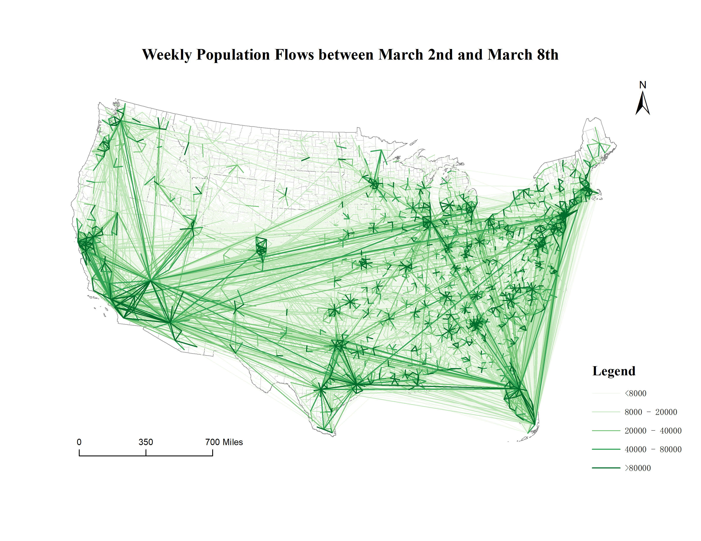

[![MIT License][license-shield]][license-url]


The data processing framework for the mobility flow dataset production.
<!-- PROJECT LOGO -->
<br />
<p align="center">
  <a href="https://geods.geography.wisc.edu/">
    
  </a>

  <h2 align="center">Multiscale Dynamic Human Mobility Flow Data in the U.S. during the COVID-19 Epidemic</h2>

  <p align="center">
    GeoDS Lab, Department of Geography, University of Wisconsin-Madison.
    <br />
    <a href="https://geods.geography.wisc.edu/covid-19-physical-distancing">Website</a>
    ·
    <a href="http://geods.geography.wisc.edu/covid19/King_WA.html">View Demo</a>
  </p>
</p>


<!-- TABLE OF CONTENTS -->
## Table of Contents

* [Citation](#citation)
* [About the Project](#about-the-project)
* [Data Processing and Data Descriptor](#data-processing-and-data-descriptor)
* [Field Descriptions](#field-descriptions)
* [Folder Structure](#folder-structure)
* [License](#license)
* [Contact](#contact)
* [Acknowledgements](#acknowledgements)

<!-- Citation -->
## Citation


<!-- ABOUT THE PROJECT -->
## About The Project


The efficiency of reducing human mobility and social activities has been proved for containing the transmission of the COVID-19 epidemic. Many governments have responded with public health interventions such as social distancing, lockdown cities, stay-at-home orders, and travel restrictions. 
Understanding dynamic human mobility changes and spatial interaction patterns at different geographic scales is crucial for monitoring and measuring the impacts of non-pharmaceutical interventions during the pandemic. 
In this project, we introduce a multiscale dynamic human mobility flow dataset across the United States starting from March 1st, 2020.
By tracking millions of anonymous mobile phone users’ visit trajectories to various places provided by [SafeGraph](https://www.safegraph.com/), the daily and weekly dynamic origin-to-destination (O-D) population flows are computed, aggregated, and inferred at three geographic scales including census tract to census tract, county to county, and state to state, respectively.
Results of the comparison between our mobility flow dataset and openly available data sources show high consistency, which shows the reliability of the produced data. 
Such a high spatiotemporal resolution of human mobility flow dataset at different scales over time may not only help monitor epidemic spreading dynamics and inform public health policy making and beyond, but also deepen our understanding of human behaviors and changes in the society under the unprecedented public health crisis. 


<!-- GETTING STARTED -->
## Data Processing and Data Descriptor

The data processing framework for the mobility flow dataset production:  
<p align="center">
  <a href="https://geods.geography.wisc.edu/">
    
  </a>
</p>

Spatial distribution of places collected by [SafeGraph](https://www.safegraph.com/) across the whole United States.  
<p align="center">
  <a href="https://geods.geography.wisc.edu/">
    
  </a>
</p>

Spatial patterns of mobility flows during March 2nd to March 8th at the county to county level.  
<p align="center">
  <a href="https://geods.geography.wisc.edu/">
    
  </a>
</p>

Spatial patterns of mobility flows during April 6th to April 12th at the county to county level.  
<p align="center">
  <a href="https://geods.geography.wisc.edu/">
    
  </a>
</p>

Temporal patterns of mobility flows in five metropolitan areas: New York, Los Angeles, Chicago, Seattle, and Houston. A: daily visitor flows; B: daily population flows; C: weekly visitor flows; D: weekly population flows. Date range: daily flow data from March 1st to May 24th, 2020, weekly flow data fromMarch 2nd to May 17th, 2020.  
<p align="center">
  <a href="https://geods.geography.wisc.edu/">
    
  </a>
</p>


A full description of the methodology used for this study can be found here: .

## Folder Structure
Data provided in this repository are separated into two folders <em>daily_flows</em> and <em>weekly_flows</em> to store daily flow data and weekly flow data.
The two folders are organized according to the geographic scale, where <em>ct2ct</em> indicates flows between census tract to census tract, <em>county2county</em> refers to flows between county to county, and <em>state2state</em> contains flow data originate from one state to others.
All files are stored in a csv format, which has been widely used for storing, transferring, and sharing data in the field of data science.
File names are formatted as <em>{data_type} \_ {spatial_scale}\_ {date}.csv</em>, e.g. <em>weekly_ct2ct_03_02.csv</em> and <em>daily_state2state_04_19.csv</em>.
Specifically, for weekly flow data, the dates in file name refers to the date of the Monday in that week but summarize all mobility flows in that week from Monday to Sunday.
Since the file size of flow data at census tract level exceeds the GitHub disk limit, each flow data file is split into 20 files.


The folders and files are organized as follows.   
```
project
|-- codes
|-- daily_flows
|   |-- state2state
|   |   |-- daily_state2state_03_01.csv
|   |   |-- daily_state2state_03_02.csv
|   |   `-- ...
|   |-- county2county
|   |   |-- daily_county2county_03_01.csv
|   |   |-- daily_county2county_03_02.csv
|   |   `-- ...
|   `-- ct2ct
|       |-- 03_01
|       |   |-- daily_ct2ct_03_01_0.csv
|       |   |-- daily_ct2ct_03_01_1.csv
|       |   `-- ...
|       |-- 03_02
|       |   |-- daily_ct2ct_03_02_0.csv
|       |   |-- daily_ct2ct_03_02_1.csv
|       |   `-- ...
|       `-- ...
`-- weekly_flows
    |-- state2state
    |   |-- weekly_state2state_03_02.csv
    |   |-- weekly_state2state_03_09.csv
    |   `-- ...
    |-- county2county
    |   |-- weekly_county2county_03_02.csv
    |   |-- weekly_county2county_03_09.csv
    |   `-- ...
    `-- ct2ct
        |-- 03_02
        |   |-- weekly_ct2ct_03_02_0.csv
        |   |-- weekly_ct2ct_03_02_1.csv
        |   `-- ...
        |-- 03_09
        |   |-- weekly_ct2ct_03_09_0.csv
        |   |-- weekly_ct2ct_03_09_1.csv
        |   `-- ...
        `-- ...
```

## Field Descriptions
A description of all attributes in the database is shown below:  

#### Weekly Flow Data (folder: weekly_flows)
geoid\_o - Unique identifier of the origin geographic unit (census tract, county, and state). Type: string.   
geoid\_d - Unique identifier of the destination geographic unit (census tract, county, and state). Type: string.   
lat\_o - Latitude of the geometric centroid of the origin unit. Type: float.   
lng\_o - Longitude of the geometric centroid of the origin unit. Type: float.   
lat\_d - Latitude of the geometric centroid of the destination unit. Type: float.   
lng\_d - Longitude of the geometric centroid of the destination unit. Type: float.   
date\_range - Date range of the records. Type: string.   
visitor\_flows - Estimated number of visitors detected by SafeGraph between the two geographic units (from geoid\_o to geoid\_d). Type: float.   
pop\_flows - Estimated population flows between the two geographic units (from geoid\_o to geoid\_d), inferred from visitor\_flows. Type: float.  

#### Daily Flow Data (folder: daily_flows)
geoid\_o -  Unique identifier of the origin geographic unit (census tract, county, and state). Type: string.  
geoid\_d - Unique identifier of the destination geographic unit (census tract, county, and state). Type: string.  
lat\_o - Latitude of the geometric centroid of the origin unit. Type: float.  
lng\_o - Longitude of the geometric centroid of the origin unit. Type: float.  
lat\_d - Latitude of the geometric centroid of the destination unit. Type: float.  
lng\_d - Longitude of the geometric centroid of the destination unit. Type: float.  
date - Date of the records. Type: string.  
visitor\_flows - Estimated number of visitors between the two geographic units (from geoid\_o to geoid\_d). Type: float.  
pop\_flows - Estimated population flows between the two geographic units (from geoid\_o to geoid\_d), inferred from visitor\_flows. Type: float.  

#### Combine Files
Please note that at census tract level, since file sizes are larger than 100 MB, we split them into 20 files.  
To merge them together conveniently, we provide <em>merge_files.py</em> to combine all files under one folder together.  
Usage:   
    
```
    python merge_files.py -i [input_folder] -o [output_file_path]
```
    
-i input folder path  
-o output file path  
    

For example:  
    
```
    python merge_files.py -i ../weekly_flows/ct2ct/04_06/ -o weekly_ct2ct_04_06.csv
```

    
<!-- LICENSE -->
## License

Distributed under the MIT License. See `LICENSE` for more information.


<!-- CONTACT -->
## Contact

Song Gao - [@gissong](https://twitter.com/gissong) - song.gao at wisc.edu  
Yuhao Kang - [@YuhaoKang](https://twitter.com/YuhaoKang) - yuhao.kang at wisc.edu  

Project Link: [https://github.com/GeoDS/COVID19USFlows](https://github.com/GeoDS/COVID19USFlows)  


<!-- ACKNOWLEDGEMENTS -->
## Acknowledgements
* [SafeGraph](https://www.safegraph.com/)
* [GeoDS Lab](https://geods.geography.wisc.edu/)

## Funding
We would like to thank the funding support provided by the National Science Foundation (Award No. BCS-2027375). Any opinions, findings, and conclusions or recommendations expressed in this material are those of the author(s) and do not necessarily reflect the views of the National Science Foundation. Support for this research was partly provided by the University of Wisconsin - Madison Office of the Vice Chancellor for Research and Graduate Education with funding from the Wisconsin Alumni Research Foundation.


<!-- MARKDOWN LINKS & IMAGES -->
[license-shield]: https://img.shields.io/github/license/othneildrew/Best-README-Template.svg?style=flat-square
[license-url]: https://github.com/GeoDS/COVID19USFlows/blob/master/LICENSE.txt
