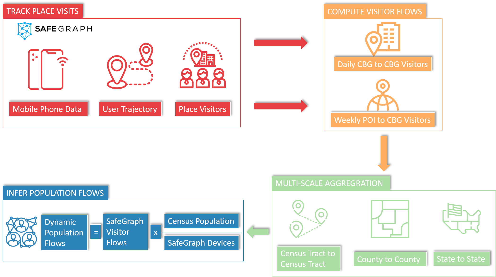
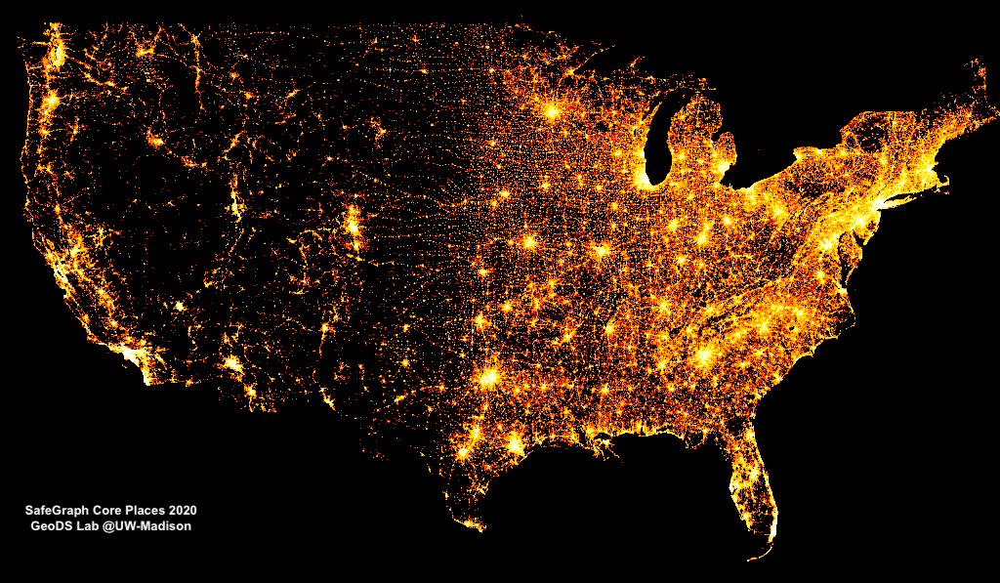
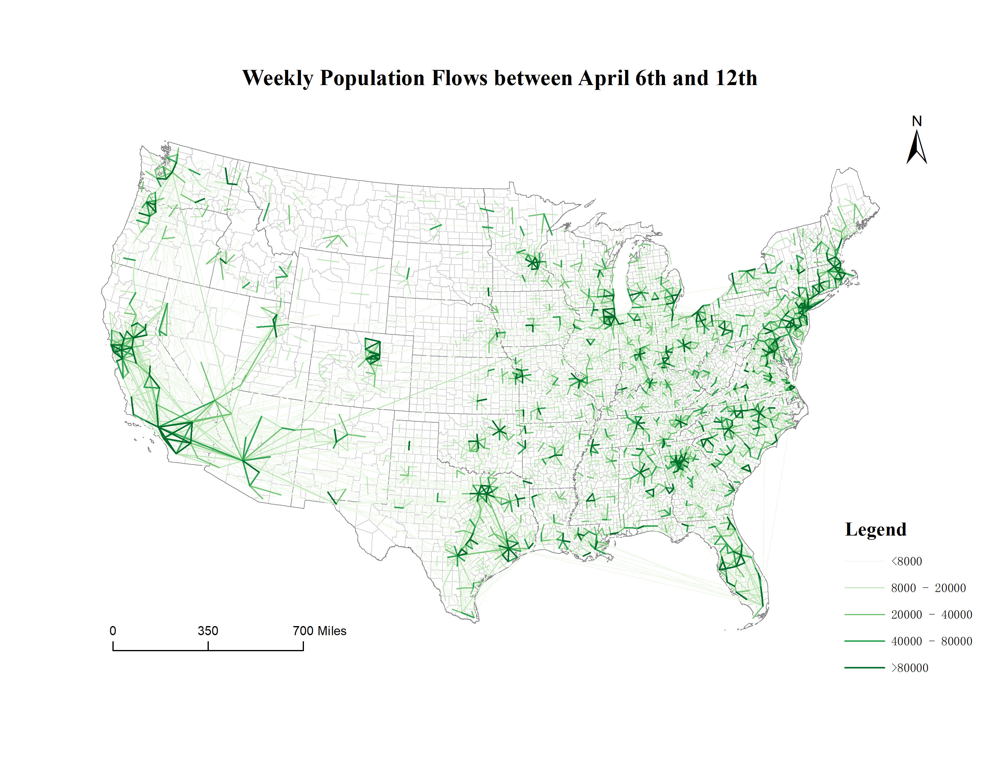
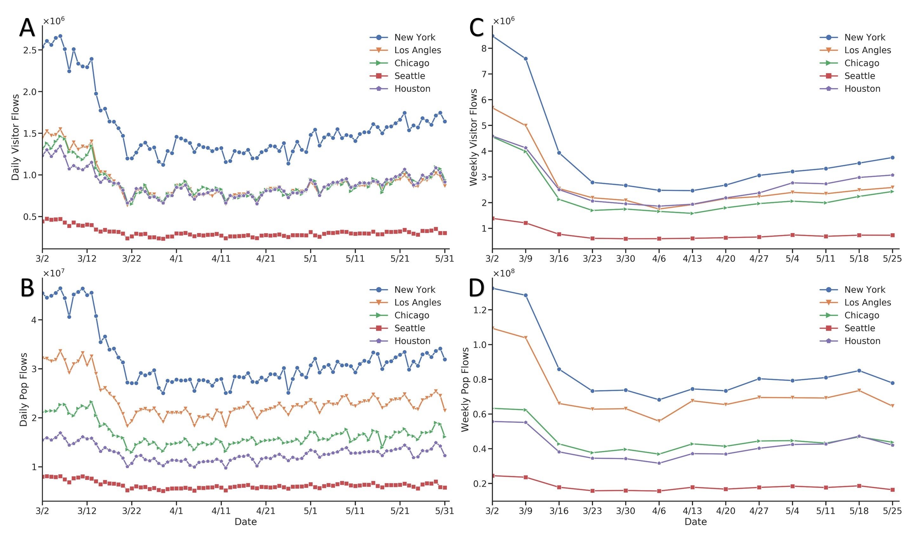

[![MIT License][license-shield]][license-url]

<!-- PROJECT LOGO -->
<br />
<p align="center">
  <a href="https://geods.geography.wisc.edu/">
    

  <h2 align="center">Multiscale Dynamic Human Mobility Flow Dataset in the U.S. during the COVID-19 Epidemic</h2>

  <p align="center">
    GeoDS Lab, Department of Geography, University of Wisconsin-Madison.
    <br />
    <a href="https://geods.geography.wisc.edu/covid-19-physical-distancing">Website</a>
    ·
    <a href="http://geods.geography.wisc.edu/covid19/King_WA.html">View Demo</a>
  </p>
</p>


<!-- TABLE OF CONTENTS -->
## Table of Contents

* [Citation](#citation)
* [About the Project](#about-the-project)
* [Data Processing and Data Descriptor](#data-processing-and-data-descriptor)
* [Field Descriptions](#field-descriptions)
* [Folder Structure](#folder-structure)
* [How to Download Data?](#code-usage)
* [License](#license)
* [Contact](#contact)
* [Acknowledgements](#acknowledgements)

<!-- Citation -->
## Citation
If you use this dataset in your research or applications, please cite this source:


Kang, Y., Gao, S., Liang, Y. et al. Multiscale dynamic human mobility flow dataset in the U.S. during the COVID-19 epidemic. *Scientific Data* 7, 390 (2020). https://doi.org/10.1038/s41597-020-00734-5
    

```
@article{kang2020multiscale,
  title     = {Multiscale Dynamic Human Mobility Flow Dataset in the U.S. during the COVID-19 Epidemic},
  author    = {Kang, Yuhao and Gao, Song and Liang, Yunlei and Li, Mingxiao and Kruse, Jake},
  journal   = {Scientific Data},
  volumn    = {7},
  issue     = {390},
  pages     = {1--13},
  year = {2020}
}
```

<!-- ABOUT THE PROJECT -->
## About The Project


Understanding dynamic human mobility changes and spatial interaction patterns at different geographic scales is crucial for monitoring and measuring the impacts of non-pharmaceutical interventions (such as stay-at-home orders) during the pandemic. In this data descriptor, we introduce an up-to-date multiscale dynamic human mobility flow dataset across the United States, with data starting from January 1st, 2020. By analyzing millions of anonymous mobile phone users’ visit trajectories to various places provided by [SafeGraph](https://www.safegraph.com/), the daily and weekly dynamic origin-to-destination (O-D) population flows are computed, aggregated, and inferred at three geographic scales: census tract, county, and state. There is high correlation between our mobility flow dataset and openly available data sources, which shows the reliability of the produced data. Such a high spatiotemporal resolution human mobility flow dataset at different geographic scales over time may help monitor epidemic spreading dynamics, inform public health policy, and deepen our understanding of human behavior changes under the unprecedented public health crisis. This up-to-date O-D flow open data can support many other social sensing and transportation applications.

<!-- GETTING STARTED -->
## Data Processing and Data Descriptor

The data processing framework for the mobility flow dataset production:  
<p align="center">
  <a href="https://geods.geography.wisc.edu/">
    
  </a>
</p>

Spatial distribution of places collected by [SafeGraph](https://www.safegraph.com/) across the whole United States.  
<p align="center">
  <a href="https://geods.geography.wisc.edu/">
    
  </a>
</p>

Spatial patterns of mobility flows during March 2nd to March 8th at the county to county level.  
<p align="center">
  <a href="https://geods.geography.wisc.edu/">
    
  </a>
</p>

Spatial patterns of mobility flows during April 6th to April 12th at the county to county level.  
<p align="center">
  <a href="https://geods.geography.wisc.edu/">
    
  </a>
</p>

Temporal patterns of mobility flows in five metropolitan areas (just as examples; the data cover the whole US): New York, Los Angeles, Chicago, Seattle, and Houston. A: daily visitor flows; B: daily population flows; C: weekly visitor flows; D: weekly population flows. Date range: from March 2nd to May 31st, 2020. 
<p align="center">
  <a href="https://geods.geography.wisc.edu/">
    
  </a>
</p>


A full description of the methodology used for this study can be found here: [https://arxiv.org/abs/2008.12238](https://arxiv.org/abs/2008.12238).

## Folder Structure
Data provided in this repository are separated into two folders <em>daily_flows</em> and <em>weekly_flows</em> to store daily flow data and weekly flow data.
The two folders are organized according to the geographic scale, where <em>ct2ct</em> indicates flows between census tract to census tract, <em>county2county</em> refers to flows between county to county, and <em>state2state</em> contains flow data originate from one state to others.
All files are stored in a csv format, which has been widely used for storing, transferring, and sharing data in the field of data science.
File names are formatted as <em>{data_type} \_ {spatial_scale}\_ {date}.csv</em>, e.g. <em>weekly_ct2ct_03_02.csv</em> and <em>daily_state2state_04_19.csv</em>.
Specifically, for weekly flow data, the dates in file name refers to the date of the Monday in that week but summarize all mobility flows in that week from Monday to Sunday.
Since the file size of flow data at census tract level exceeds the GitHub disk limit, each flow data file is split into 20 files.


The folders and files are organized as follows.   
```
project
|-- codes
|-- daily_flows
|   |-- state2state
|   |   |-- daily_state2state_03_01.csv
|   |   |-- daily_state2state_03_02.csv
|   |   `-- ...
|   |-- county2county
|   |   |-- daily_county2county_03_01.csv
|   |   |-- daily_county2county_03_02.csv
|   |   `-- ...
|   `-- ct2ct
|       |-- 03_01
|       |   |-- daily_ct2ct_03_01_0.csv
|       |   |-- daily_ct2ct_03_01_1.csv
|       |   `-- ...
|       |-- 03_02
|       |   |-- daily_ct2ct_03_02_0.csv
|       |   |-- daily_ct2ct_03_02_1.csv
|       |   `-- ...
|       `-- ...
`-- weekly_flows
    |-- state2state
    |   |-- weekly_state2state_03_02.csv
    |   |-- weekly_state2state_03_09.csv
    |   `-- ...
    |-- county2county
    |   |-- weekly_county2county_03_02.csv
    |   |-- weekly_county2county_03_09.csv
    |   `-- ...
    `-- ct2ct
        |-- 03_02
        |   |-- weekly_ct2ct_03_02_0.csv
        |   |-- weekly_ct2ct_03_02_1.csv
        |   `-- ...
        |-- 03_09
        |   |-- weekly_ct2ct_03_09_0.csv
        |   |-- weekly_ct2ct_03_09_1.csv
        |   `-- ...
        `-- ...
```

## Field Descriptions
A description of all attributes in the database is shown below:  

#### Weekly Flow Data (folder: weekly_flows)
geoid\_o - Unique identifier of the origin geographic unit (census tract, county, and state). Type: string.   
geoid\_d - Unique identifier of the destination geographic unit (census tract, county, and state). Type: string.   
lat\_o - Latitude of the geometric centroid of the origin unit. Type: float.   
lng\_o - Longitude of the geometric centroid of the origin unit. Type: float.   
lat\_d - Latitude of the geometric centroid of the destination unit. Type: float.   
lng\_d - Longitude of the geometric centroid of the destination unit. Type: float.   
date\_range - Date range of the records. Type: string.   
visitor\_flows - Estimated number of visitors detected by SafeGraph between the two geographic units (from geoid\_o to geoid\_d). Type: float.   
pop\_flows - Estimated population flows between the two geographic units (from geoid\_o to geoid\_d), inferred from visitor\_flows. Type: float.  

#### Daily Flow Data (folder: daily_flows)
geoid\_o -  Unique identifier of the origin geographic unit (census tract, county, and state). Type: string.  
geoid\_d - Unique identifier of the destination geographic unit (census tract, county, and state). Type: string.  
lat\_o - Latitude of the geometric centroid of the origin unit. Type: float.  
lng\_o - Longitude of the geometric centroid of the origin unit. Type: float.  
lat\_d - Latitude of the geometric centroid of the destination unit. Type: float.  
lng\_d - Longitude of the geometric centroid of the destination unit. Type: float.  
date - Date of the records. Type: string.  
visitor\_flows - Estimated number of visitors between the two geographic units (from geoid\_o to geoid\_d). Type: float.  
pop\_flows - Estimated population flows between the two geographic units (from geoid\_o to geoid\_d), inferred from visitor\_flows. Type: float.  

## Code Usage
**How to Download Data?**
We provide a set of tools for downloading data.  

#### Command Line
If you are Linux/Mac users, you can use **wget/curl** to download data files.
```
wget https://raw.githubusercontent.com/GeoDS/COVID19USFlows/master/{data_type}_flows/{spatial_scale}/{data_type}_{spatial_scale}_{date}.csv
```

```
curl https://raw.githubusercontent.com/GeoDS/COVID19USFlows/master/{data_type}_flows/{spatial_scale}/{data_type}_{spatial_scale}_{date}.csv --output output_file.csv
```

Example:  
Download daily county level data of March 1st using **wget**.
```
wget https://raw.githubusercontent.com/GeoDS/COVID19USFlows/master/daily_flows/county2county/daily_county2county_03_01.csv
```

You can also use the following python codes to download daily patterns and weekly patterns.

#### Download Daily Patterns
To download daily patterns at different spatial scales, you can use <em>[codes/download_daily_data.py](https://raw.githubusercontent.com/GeoDS/COVID19USFlows/master/codes/download_daily_data.py)</em> with the specified date range.  
Usage:
    
```
    python download_daily_data.py --start_month [start_month] --start_day [start_day] --end_month [end_month] --end_day [end_day] --output_folder [output_folder] --ct --county --state
```

```
--start_month (required parameter), month of the start date
--start_day (required parameter), day of the start date
--end_month  month of the end date, default is the start_month
--end_day    day of the start date, default is the start_day
--output_folder (required), output folder
--ct download data at the census tract level
--county download data at the county level
--state download data at the state level
```

Example:  
Download county level data of March 1st to the <em>daily_flows</em> folder.
```
    python download_daily_data.py --start_month 3 --start_day 1 --output_folder daily_flows  --county 
```

Download state level and census tract level data from March 1st to March 10th to the <em>daily_flows</em> folder.
```
    python download_daily_data.py --start_month 3 --start_day 1 --end_month 3 --end_day 10 --output_folder daily_flows --state --ct
```

#### Download Weekly Patterns
To download weekly patterns at different spatial scales, you can use <em>[codes/download_weekly_data.py](https://raw.githubusercontent.com/GeoDS/COVID19USFlows/master/codes/download_weekly_data.py)</em> with the specified data range.  
**Please note that the start date and the end date must be Monday.**  
Usage:
    
```
    python download_weekly_data.py --start_month [start_month] --start_day [start_day] --end_month [end_month] --end_day [end_day] --output_folder [output_folder] --ct --county --state
```

```
--start_month (required parameter), month of the start date (must be a Monday)
--start_day (required parameter), day of the start date (must be a Monday)
--end_month  month of the end date (must be a Monday), default is the start_month
--end_day    day of the start date (must be a Monday), default is the end_day
--output_folder (required parameter), output folder
--ct download data at the census tract level
--county download data at the county level
--state download data at the state level
```

Example:  
Download county level data of the week of March 2nd-8th to the <em>weekly_flows</em> folder.
```
    python download_weekly_data.py --start_month 3 --start_day 2 --output_folder weekly_flows  --county 
```

Download state level and census tract level data from the week of March 2st-8th to the week of March 23th-29th to the <em>weekly_flows</em> folder.
```
    python download_weekly_data.py --start_month 3 --start_day 2 --end_month 3 --end_day 23 --output_folder weekly_flows --state --ct
```


#### Combine Files
Please note that at census tract level, since file sizes are larger than 100 MB, we split them into 20 files.  
To merge them together conveniently, we provide <em>[codes/merge_files.py](https://raw.githubusercontent.com/GeoDS/COVID19USFlows/master/codes/merge_files.py)</em> to combine all files under one folder together.  
Usage:   
    
```
    python merge_files.py -i [input_folder] -o [output_file_path]
```
    
```
-i input folder path  
-o output file path  
```

Example:  
Combine all census tract files under the folder <em>../weekly_flows/ct2ct/04_06</em> to a single file <em>weekly_ct2ct_04_06.csv</em>
    
```
    python merge_files.py -i ../weekly_flows/ct2ct/04_06/ -o weekly_ct2ct_04_06.csv
```

    
<!-- LICENSE -->
## License

Distributed under the MIT License. See `LICENSE` for more information.


<!-- CONTACT -->
## Contact

Song Gao - [@gissong](https://twitter.com/gissong) - song.gao at wisc.edu  
Yuhao Kang - [@YuhaoKang](https://twitter.com/YuhaoKang) - yuhao.kang at wisc.edu  

Project Link: [https://github.com/GeoDS/COVID19USFlows](https://github.com/GeoDS/COVID19USFlows)  


<!-- ACKNOWLEDGEMENTS -->
## Acknowledgements
* [SafeGraph](https://www.safegraph.com/)
* [GeoDS Lab](https://geods.geography.wisc.edu/)

## Funding
We would like to thank the funding support provided by the National Science Foundation (Award No. BCS-2027375). Any opinions, findings, and conclusions or recommendations expressed in this material are those of the author(s) and do not necessarily reflect the views of the National Science Foundation. Support for this research was partly provided by the University of Wisconsin - Madison Office of the Vice Chancellor for Research and Graduate Education with funding from the Wisconsin Alumni Research Foundation.


<!-- MARKDOWN LINKS & IMAGES -->
[license-shield]: https://img.shields.io/github/license/othneildrew/Best-README-Template.svg?style=flat-square
[license-url]: https://github.com/GeoDS/COVID19USFlows/blob/master/LICENSE.txt
